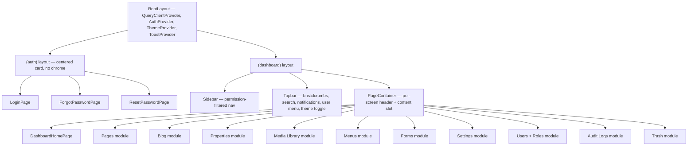

# Truzon CMS — Admin Frontend Component Hierarchy

Deliverable #5 of the "before writing code" sequence. Maps directly onto `API.md` (one module
screen ≈ one or two endpoints) and the `frontend/` folder skeleton from `ARCHITECTURE.md`
(`app/(dashboard)/{module}`, `components/`, `modules/`).

## Top-level composition

Each module box below is its own subtree, composed from `components/ui`, `components/layout`,
`components/data-table`, `components/forms`, and `components/blocks`, per module in
`modules/{name}`.

## Dashboard (`app/(dashboard)/dashboard`)

- `DashboardHomePage`
  - `StatCard` × 5 — Total Users, Published Pages, Draft Pages, Total Blog Posts, Storage Used (from `GET /dashboard/stats`)
  - `RecentActivityList` (from `GET /dashboard/recent-activity`)
  - `RecentLoginsList`
  - `PendingReviewsList` — drafts awaiting publish
  - `LatestUploadsGrid` — thumbnail strip
  - `QuickActionsPanel` — "New Blog Post," "Upload Media," etc.

## Pages (`app/(dashboard)/pages`) — fixed 5 types

- `PagesListPage`
  - `PageStatusCard` × 5 (Home/About/Projects/Blog/Contact — status pill, last updated, "Edit" action)
- `PageEditorPage` (`/pages/[pageType]`)
  - `PageEditorHeader` — status pill, Preview / Publish / Unpublish / Schedule / Save, "Version History" trigger
  - `BlockBuilderCanvas`
    - `BlockList` — drag-and-drop reorderable (maps to `PUT /pages/{type}/blocks/reorder`)
      - `BlockListItem` × N — collapsed summary, edit/duplicate/delete
    - `BlockPalette` (modal) — reads `GET /block-definitions`, inserts via `POST /pages/{type}/blocks`
    - `BlockEditorPanel` — renders the editor matching the selected block's `block_definition.key`:
      `HeroBannerBlockEditor`, `TextBlockEditor`, `ImageBlockEditor`, `GalleryBlockEditor`,
      `VideoBlockEditor`, `FaqBlockEditor`, `TestimonialsBlockEditor`, `FeaturesBlockEditor`,
      `PricingBlockEditor`, `TeamBlockEditor`, `TimelineBlockEditor`, `MapBlockEditor`,
      `AccordionBlockEditor`, `StatisticsBlockEditor`, `ContactFormBlockEditor`, `CtaBlockEditor`,
      `SpacerBlockEditor`, `DividerBlockEditor` — one file each under `components/blocks/`, each
      wrapping the block's `config` shape in a React Hook Form
  - `SeoPanel` — `SeoTitleInput`, `MetaDescriptionInput`, `KeywordsInput`, `CanonicalUrlInput`,
    `OgImagePicker` (opens `MediaPicker`), `SchemaJsonLdEditor` — **shared**, reused by Blog and
    Properties editors too
  - `VersionHistoryDrawer` — `VersionListItem` × N, each with a Restore action

## Blog (`app/(dashboard)/blog`)

- `BlogPostsListPage`
  - `TableToolbar` — search, status filter, category filter, "New Post"
  - `DataTable` (shared) — title, category, author, status, published_at
  - `BulkActionsBar` — publish/delete selected
- `BlogPostEditorPage` (`/blog/posts/[id]`)
  - `PostEditorHeader` — status pill, Publish/Schedule/Duplicate/Save
  - `RichTextEditor` — post body
  - `PostMetaPanel` — category select, tag multi-select, author select, featured image
    (`MediaPicker`), reading time (auto-computed, editable override)
  - `SeoPanel` (shared)
  - `VersionHistoryDrawer` (shared)
- `CategoriesListPage`, `TagsListPage` — simple `DataTable` + inline create/rename/delete;
  `Category` rows show an `applies_to` badge (blog/property/both)

## Properties (`app/(dashboard)/properties`)

- `PropertiesListPage`
  - `TableToolbar` — search, city/type/status filters, "New Property"
  - `DataTable` (shared) — name, city, type, price, status
- `PropertyEditorPage` (`/properties/[id]`)
  - `PropertyEditorHeader` — status pill, Publish/Unpublish/Duplicate/Save
  - `PropertyDetailsForm` — name, slug, city, location, price display + value, budget bracket,
    spec_a/spec_b, area, beds options (tag input), tag/status badge text + color pickers
  - `GalleryManager` — drag-reorder thumbnails, "Add from Media Library" opens `MediaPicker`
  - `SeoPanel` (shared)

## Media Library (`app/(dashboard)/media`)

- `MediaLibraryPage`
  - `FolderTree` — nested folders sidebar-within-page
  - `MediaUploadDropzone` — drag-and-drop + bulk upload progress bars
  - `MediaGrid` — thumbnails, multi-select, type/search filter via `TableToolbar`-equivalent
  - `MediaDetailsDrawer` — alt text, dimensions, file size, `UsageList` (from
    `GET /media/{id}/usage`), delete with a usage-count warning before `?force=true`
- `MediaPicker` (modal, not a route) — reused anywhere an image/file is selected: Pages blocks,
  Blog featured image, Property gallery, Menus, Settings logo/favicon

## Menus (`app/(dashboard)/menus`)

- `MenuEditorPage` (one per menu `key`: header, footer_company, footer_properties, footer_resources, footer_legal)
  - `MenuItemTree` — nested drag-and-drop; each `MenuItemRow` toggles internal (`Page` select) vs
    external (`URL` input) linking, plus "open in new tab"

## Forms (`app/(dashboard)/forms`)

- `FormSubmissionsListPage`
  - `TableToolbar` — form_key filter, status filter, "Export CSV"
  - `DataTable` (shared) — name, phone, email, form_key, status, submitted_at
  - `SubmissionDetailsDrawer` — full submission, status update, assign-to select

## Settings (`app/(dashboard)/settings`)

- `SettingsPage` — tabbed (`Tabs` from shadcn/ui)
  - `GeneralSettingsForm` — site name, logo/favicon (`MediaPicker`), contact info
  - `SocialLinksForm`
  - `SmtpSettingsForm`
  - `AnalyticsSettingsForm`
  - `ThemeSettingsForm`
  - `CustomScriptsForm` — code editor fields, escaped/sanitized server-side
  - `SettingsVersionHistoryDrawer` (shared `VersionHistoryDrawer`)

## Users, Roles (`app/(dashboard)/users`, `/roles`)

- `UsersListPage` — `TableToolbar` + `DataTable` (name, email, role, status, last login)
- `UserEditorDrawer` — profile fields, role select, active toggle, "force password reset"
- `RolesListPage` — `DataTable`
- `RoleEditorDrawer` — name, description, `PermissionMatrix` (checkboxes grouped by module,
  matches `GET /permissions`)

## Audit Logs, Trash, Search

- `AuditLogsPage` — `TableToolbar` (user/action/entity/date-range filters, "Export") + `DataTable`
- `TrashPage` — grouped by `entity_type` (tabs or accordion), `Restore` / `Delete permanently`
  actions per row
- `GlobalSearchOverlay` — ⌘K-triggered from `Topbar`, calls `GET /search?q=`, results grouped by
  module (Pages/Blog/Properties/Media/Users)

## Shared components referenced above

(Full spec — props, variants, states — is deliverable #9, "reusable UI component list." This is
just the inventory so the tree above is legible.)

`DataTable`, `TableToolbar`, `Pagination`, `StatusPill`, `ConfirmDialog`, `Drawer`, `Modal`,
`Toast`, `Breadcrumbs`, `EmptyState`, `LoadingSkeleton`, `MediaPicker`, `SeoPanel`,
`VersionHistoryDrawer`, `PermissionMatrix`, plus shadcn/ui form primitives (`Input`, `Select`,
`Textarea`, `Switch`, `Tabs`, `Command` for the search overlay) wrapped in React Hook Form field
components under `components/forms/`.

## Next

Deliverable #6: **navigation flow** — how an admin actually moves screen to screen (login →
dashboard → edit a page → block editor → publish, etc.), built on this hierarchy.
