# Truzon CMS — Database ER Diagram

Deliverable #2 of the "before writing code" sequence. All tables use **UUID primary keys** and
(unless noted) `created_at` / `updated_at` timestamps. Soft-delete (`deleted_at`, `deleted_by`)
is a cross-cutting mixin applied to user-deletable content — `blog_post`, `property`, `media`,
`menu_item`, `user` — not a separate "Trash" table; the Trash module is a filtered query
(`WHERE deleted_at IS NOT NULL`) across those tables.

Version history (Pages, Blog posts, Settings) is **one generic polymorphic table**
(`entity_version`), not three near-duplicate tables — matches the "reusable module" principle.

Categories & Tags are **shared taxonomy** — the same `category` table classifies both Blog posts
and Properties (Property "type" — Villas/Apartments/Plots/… — is modeled as categories scoped to
properties, not a separate hardcoded enum table).

## Diagram

```mermaid
erDiagram
    %% --- Auth & Access ---
    USER ||--o{ REFRESH_TOKEN : issues
    USER }o--|| ROLE : has
    ROLE ||--o{ ROLE_PERMISSION : grants
    PERMISSION ||--o{ ROLE_PERMISSION : "included in"

    %% --- Pages (fixed 5 types) & Block Builder ---
    USER ||--o{ PAGE : "authors"
    PAGE ||--o{ PAGE_BLOCK : contains
    BLOCK_DEFINITION ||--o{ PAGE_BLOCK : "instance of"
    PAGE ||--o| SEO_META : has
    MEDIA ||--o{ PAGE : "featured image for"

    %% --- Blog ---
    USER ||--o{ BLOG_POST : writes
    BLOG_POST ||--o| SEO_META : has
    MEDIA ||--o{ BLOG_POST : "featured image for"
    BLOG_POST ||--o{ BLOG_POST_CATEGORY : "classified via"
    CATEGORY ||--o{ BLOG_POST_CATEGORY : classifies
    BLOG_POST ||--o{ BLOG_POST_TAG : "tagged via"
    TAG ||--o{ BLOG_POST_TAG : tags

    %% --- Properties ---
    PROPERTY ||--o| SEO_META : has
    MEDIA ||--o{ PROPERTY : "featured image for"
    PROPERTY ||--o{ PROPERTY_MEDIA : "gallery via"
    MEDIA ||--o{ PROPERTY_MEDIA : "used in gallery"
    PROPERTY ||--o{ PROPERTY_CATEGORY : "classified via"
    CATEGORY ||--o{ PROPERTY_CATEGORY : classifies

    %% --- Media Library ---
    MEDIA_FOLDER ||--o{ MEDIA_FOLDER : "parent of"
    MEDIA_FOLDER ||--o{ MEDIA : contains
    USER ||--o{ MEDIA : uploads
    MEDIA ||--o{ MEDIA_USAGE : "referenced by"

    %% --- Menus ---
    MENU ||--o{ MENU_ITEM : contains
    MENU_ITEM ||--o{ MENU_ITEM : "parent of"
    PAGE ||--o{ MENU_ITEM : "linked by"

    %% --- Forms, Settings, Ops ---
    USER ||--o{ FORM_SUBMISSION : "assigned to"
    USER ||--o{ SETTING : "last updated by"
    USER ||--o{ NOTIFICATION : receives
    USER ||--o{ AUDIT_LOG : performs
    USER ||--o{ ENTITY_VERSION : authors

    USER {
        uuid id PK
        string email UK
        string password_hash
        string full_name
        uuid role_id FK
        uuid avatar_media_id FK
        boolean is_active
        boolean is_email_verified
        boolean two_factor_enabled
        timestamp last_login_at
        timestamp deleted_at
    }

    ROLE {
        uuid id PK
        string name UK
        string description
        boolean is_system
    }

    PERMISSION {
        uuid id PK
        string key UK
        string module
        string description
    }

    ROLE_PERMISSION {
        uuid role_id FK
        uuid permission_id FK
    }

    REFRESH_TOKEN {
        uuid id PK
        uuid user_id FK
        string token_hash
        timestamp expires_at
        timestamp revoked_at
        string ip_address
        string user_agent
    }

    PAGE {
        uuid id PK
        enum page_type UK "home | about | projects | blog | contact"
        string slug UK
        string title
        enum status "draft | scheduled | published | unpublished"
        timestamp published_at
        timestamp scheduled_at
        uuid featured_image_media_id FK
        uuid seo_id FK
        uuid created_by FK
        uuid updated_by FK
    }

    BLOCK_DEFINITION {
        uuid id PK
        string key UK "hero_banner | text | image | gallery | video | faq | ..."
        string label
        boolean is_active
    }

    PAGE_BLOCK {
        uuid id PK
        uuid page_id FK
        uuid block_definition_id FK
        int position
        jsonb config
    }

    BLOG_POST {
        uuid id PK
        string title
        string slug UK
        text excerpt
        text body
        uuid featured_image_media_id FK
        uuid author_id FK
        enum status "draft | scheduled | published"
        timestamp published_at
        timestamp scheduled_at
        int reading_time_minutes
        boolean is_featured
        uuid seo_id FK
        timestamp deleted_at
    }

    CATEGORY {
        uuid id PK
        string name
        string slug UK
        enum applies_to "blog | property | both"
    }

    TAG {
        uuid id PK
        string name
        string slug UK
    }

    BLOG_POST_CATEGORY {
        uuid blog_post_id FK
        uuid category_id FK
    }

    BLOG_POST_TAG {
        uuid blog_post_id FK
        uuid tag_id FK
    }

    PROPERTY {
        uuid id PK
        string name
        string slug UK
        string city
        string location_text
        string price_display
        numeric price_value
        enum budget_bracket "under2 | 2to5 | 5to10 | 10plus"
        string spec_a
        string spec_b
        numeric area_sqft
        jsonb beds_options
        string tag_text
        string status_text
        boolean is_signature
        uuid featured_image_media_id FK
        uuid seo_id FK
        enum status "draft | published"
        timestamp deleted_at
    }

    PROPERTY_CATEGORY {
        uuid property_id FK
        uuid category_id FK
    }

    PROPERTY_MEDIA {
        uuid property_id FK
        uuid media_id FK
        int position
    }

    MEDIA {
        uuid id PK
        string file_name
        string file_key
        string url
        string mime_type
        bigint size_bytes
        int width
        int height
        string alt_text
        uuid folder_id FK
        uuid uploaded_by FK
        timestamp deleted_at
    }

    MEDIA_FOLDER {
        uuid id PK
        string name
        uuid parent_folder_id FK
    }

    MEDIA_USAGE {
        uuid id PK
        uuid media_id FK
        string entity_type "page | blog_post | property | menu | settings"
        uuid entity_id
        string field_name
    }

    MENU {
        uuid id PK
        string key UK "header | footer_company | footer_properties | ..."
        string label
    }

    MENU_ITEM {
        uuid id PK
        uuid menu_id FK
        uuid parent_item_id FK
        string label
        string url
        uuid page_id FK
        int position
        boolean is_external
        boolean open_in_new_tab
    }

    FORM_SUBMISSION {
        uuid id PK
        string form_key "hero_quick_enquiry | contact_callback"
        string name
        string phone
        string email
        string property_type_interest
        text message
        enum status "new | contacted | closed"
        uuid assigned_to FK
        string ip_address
        timestamp submitted_at
    }

    SEO_META {
        uuid id PK
        string seo_title
        string meta_description
        jsonb keywords
        string canonical_url
        string og_title
        string og_description
        uuid og_image_media_id FK
        string twitter_card_type
        string robots
        jsonb schema_jsonld
    }

    SETTING {
        uuid id PK
        string key UK
        jsonb value
        uuid updated_by FK
    }

    NOTIFICATION {
        uuid id PK
        uuid user_id FK
        enum type "success | error | warning | info"
        string title
        string message
        boolean is_read
        string link_url
    }

    AUDIT_LOG {
        uuid id PK
        uuid user_id FK
        string action
        string entity_type
        uuid entity_id
        string ip_address
        string device
        jsonb metadata
        timestamp created_at
    }

    ENTITY_VERSION {
        uuid id PK
        string entity_type "page | blog_post | settings"
        uuid entity_id
        int version_number
        jsonb snapshot
        string change_note
        uuid created_by FK
        timestamp created_at
    }
```

## Notes on specific design choices

- **`PAGE.page_type` is a unique enum**, not a free `slug` — enforces the "exactly 5 fixed
  pages" scope decision at the database level, not just in application code. There can only ever
  be one `home` row, one `about` row, etc.
- **`BLOCK_DEFINITION` is a lookup table, not a hardcoded enum** — adding a new block type later
  (e.g. "Pricing Table v2") is an INSERT + a new editor/renderer component, not a migration
  touching every existing page. `PAGE_BLOCK.config` is JSONB because each block type has a
  different shape (Hero Banner ≠ FAQ ≠ Statistics) — validated by a Pydantic schema chosen
  per-`block_definition_id` in the application layer, not by the database.
- **`MEDIA_USAGE` is polymorphic** (`entity_type` + `entity_id`, no DB-level FK) so "usage
  tracking" and safe-delete checks work across Pages/Blog/Properties/Menus/Settings without a
  join table per entity type. Same pattern for `AUDIT_LOG` and `ENTITY_VERSION`.
- **`CATEGORY.applies_to`** lets the same taxonomy table serve both Blog (Real Estate Trends,
  Lifestyle, Investment Guide, Buying Guide) and Property "type" (Villas, Apartments, Plots,
  Commercial, Farm Lands, Ind. Houses) — one admin screen, one table, two join tables
  (`BLOG_POST_CATEGORY`, `PROPERTY_CATEGORY`).
- **`MENU_ITEM.page_id` is nullable** — a menu item either links to one of the 5 fixed Pages
  (internal, stays correct if the page's slug ever changes) or an arbitrary `url` (external, or
  a path this CMS doesn't manage yet, e.g. `/property/{id}` detail routes).
- **Soft-delete over hard-delete** for `user`, `blog_post`, `property`, `media`: the Trash module
  is a query, not a table. `page`, `role`, `permission`, `category`, `tag` are not soft-deletable
  content in the same sense (pages are fixed; taxonomy deletion needs its own "reassign or block"
  rule, decided at build time).
- **Indexes to add at migration time** (not shown in the diagram): `page.slug`, `page.page_type`,
  `blog_post.slug`, `property.slug`, `category.slug`, `tag.slug`, `media_usage.(entity_type,
  entity_id)`, `audit_log.(entity_type, entity_id)`, `audit_log.created_at`, `entity_version.
  (entity_type, entity_id)`, `refresh_token.user_id`, `notification.(user_id, is_read)`.
