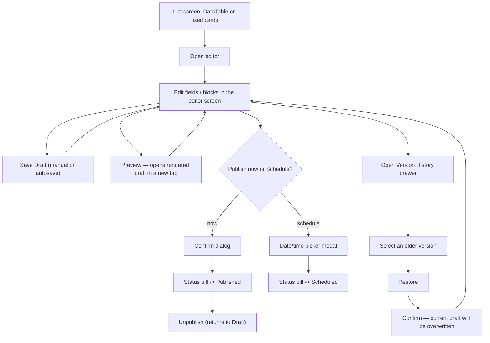

# Truzon CMS — Navigation Flow

Deliverable #6 of the "before writing code" sequence. How an admin actually moves between the
screens in `COMPONENT_HIERARCHY.md`, using the routes `/api/v1/*` and `/public/*` from `API.md`.

## Route map

| Route | Screen | Guard |
|---|---|---|
| `/login` | LoginPage | public only — redirects to `/dashboard` if already authenticated |
| `/forgot-password` | ForgotPasswordPage | public only |
| `/reset-password?token=` | ResetPasswordPage | valid token in query |
| `/dashboard` | DashboardHomePage | authenticated |
| `/pages` | PagesListPage | `pages.view` |
| `/pages/[pageType]` | PageEditorPage | `pages.view` (edit actions need `pages.edit`) |
| `/blog/posts` | BlogPostsListPage | `blog.view` |
| `/blog/posts/new` | BlogPostEditorPage (blank) | `blog.create` |
| `/blog/posts/[id]` | BlogPostEditorPage | `blog.view` |
| `/blog/categories`, `/blog/tags` | CategoriesListPage, TagsListPage | `blog.edit` |
| `/properties` | PropertiesListPage | `properties.view` |
| `/properties/new`, `/properties/[id]` | PropertyEditorPage | `properties.create` / `.view` |
| `/media` | MediaLibraryPage | `media.view` |
| `/menus/[key]` | MenuEditorPage | `settings.manage` |
| `/forms` | FormSubmissionsListPage | `forms.view` |
| `/settings?tab=` | SettingsPage | `settings.manage` |
| `/users`, `/users/[id]` | UsersListPage, UserEditorDrawer | `users.view` / `.manage` |
| `/roles`, `/roles/[id]` | RolesListPage, RoleEditorDrawer | `users.manage` |
| `/audit-logs` | AuditLogsPage | `analytics.view` |
| `/trash` | TrashPage | per-module `.delete` |

`middleware.ts` enforces the auth guard (redirect to `/login?redirect={path}` if no valid
session); permission guards are checked client-side (hide nav items, disable actions) **and**
server-side (every `/api/v1/*` call re-checks — a hidden button is a UX nicety, not a security
boundary).

## Global flows

```mermaid
flowchart TD
    Start([Visit any /dashboard/* route]) --> HasSession{Valid session?}
    HasSession -- no --> Login[/login?redirect=original path/]
    HasSession -- yes --> Dest[Requested screen]

    Login --> Submit[Submit email + password]
    Submit --> AuthOK{POST /auth/login OK?}
    AuthOK -- no --> LoginErr[Inline error, stay on /login]
    AuthOK -- yes --> SetCookie[Refresh cookie set, access token in memory]
    SetCookie --> Redirect[Redirect to original path, or /dashboard]

    Login --> Forgot["'Forgot password?' link"]
    Forgot --> ForgotPage[/forgot-password]
    ForgotPage --> ForgotSubmit[Submit email]
    ForgotSubmit --> ForgotMsg["Always: 'If that email exists, we've sent a link' (no enumeration)"]
    ForgotMsg --> EmailLink[User clicks emailed link]
    EmailLink --> ResetPage["/reset-password?token=..."]
    ResetPage --> ResetSubmit[Submit new password]
    ResetSubmit --> ResetOK{Token valid?}
    ResetOK -- yes --> LoginRedirect[Redirect to /login with success toast]
    ResetOK -- no --> ResetErr[Error: request a new link]
```

**Logout**: Topbar user menu → Logout → `POST /auth/logout` → clear client state (Zustand +
TanStack Query cache) → redirect to `/login`.

**Global search**: ⌘K / Ctrl+K anywhere in the dashboard, or the Topbar search icon → overlay
opens → debounced `GET /search?q=` → grouped results (Pages/Blog/Properties/Media/Users) →
click a result → navigate directly to its editor route → overlay closes. Escape closes without
navigating.

**Notifications**: Topbar bell shows unread count (poll or websocket, TBD at build time) → click
→ dropdown list → click a notification → mark read (`PUT /notifications/{id}/read`) → navigate
to `link_url` if present.

## Content lifecycle flow (shared pattern — Pages, Blog, Properties)

Pages, Blog posts, and Properties all follow the same list → edit → preview → publish/schedule →
version-restore shape. One diagram, not three:



**Where each module deviates from this shared shape:**

- **Pages**: `List` is always the same 5 fixed cards (no create/delete — see `ERD.md`'s unique
  `page_type` constraint). Editing happens inside `BlockBuilderCanvas` (add/reorder/remove blocks
  from the palette) rather than a single form.
- **Blog posts**: `List` supports create (`/blog/posts/new`) and soft-delete → Trash. Editing is
  a rich-text body + metadata panel, not blocks. Has a **Duplicate** action (creates a new draft
  copy, navigates to its editor).
- **Properties**: same create/delete/duplicate shape as Blog. Adds a **Gallery** step (reorder
  images via `PUT /properties/{id}/gallery`) alongside the main details form. No version history
  in this scope (noted as a v1 gap, not a missing diagram).

## Cross-cutting flows

**Choosing an image** (Pages block editor, Blog featured image, Property gallery, Menus,
Settings logo/favicon) always opens the same `MediaPicker` modal:

```mermaid
flowchart LR
    Field[Any "choose image" field] --> Picker[MediaPicker modal opens]
    Picker --> Existing[Pick existing from grid]
    Picker --> Upload[Upload new inline]
    Upload --> Existing
    Existing --> Confirm[Confirm selection]
    Confirm --> Closed[Modal closes, field populated]
```

**Restoring from Trash**: `/trash` → grouped by entity type (tabs) → find item → `Restore` →
confirm → item reappears in its module's list, status reset to `draft`.

**Handling a form submission**: `/forms` → filter by `form_key`/`status` → open row →
`SubmissionDetailsDrawer` → update `status` (new → contacted → closed) and optional
`assigned_to` → Save.

**Managing a role's permissions**: `/roles` → open a role (not `is_system`, or view-only if it
is) → `PermissionMatrix` checkboxes grouped by module → Save → full replace via
`PUT /roles/{id}/permissions`.

## Next

Deliverable #7: **wireframes** for the admin dashboard — low-fidelity layouts for Dashboard, a
list screen, an edit screen, and the block builder, built on this flow and the component tree.
