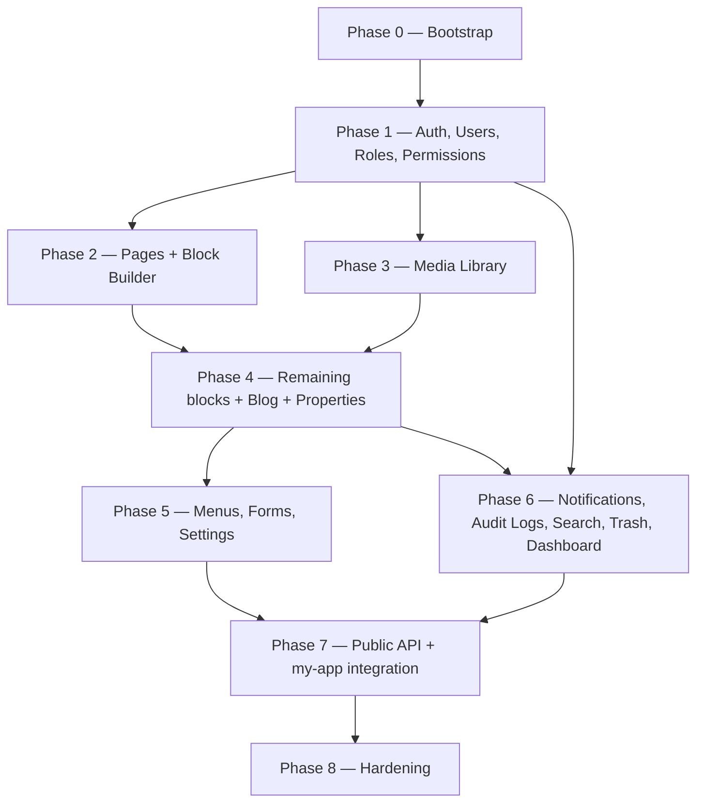

# Truzon CMS — Development Roadmap

Deliverable #8 of the "before writing code" sequence. No calendar estimates — team size and
velocity aren't known yet, so phases are ordered by **dependency** and sized **relatively**
(S/M/L/XL) instead. Each phase is a vertical slice: backend + frontend together, ending in
something actually usable, not "all models first, then all screens."

## Guiding principle

Build in the order things depend on each other, not in module-list order. Nothing in Phase 2+
works without Phase 1 (auth). Media doesn't need to be perfect before Pages can use it, but the
picker has to exist before block editors that reference images are truly done. The public API
(Phase 7) comes last on purpose — there's nothing to expose until content exists to expose.

## Phase dependency graph

## Phase 0 — Bootstrap (size: S)

Infrastructure only, no features.

- **Backend**: `fastapi` project init, PostgreSQL connection, Alembic wired up, base SQLAlchemy
  declarative class + mixins (UUID PK, `created_at`/`updated_at`, soft-delete), `core/config.py`
  (pydantic-settings from env vars), local Docker Compose for Postgres.
- **Frontend**: Next.js project init, Tailwind + shadcn/ui installed, TanStack Query + Zustand
  wired, `lib/api-client.ts` skeleton, the two route-group layouts `(auth)`/`(dashboard)` from
  `NAVIGATION_FLOW.md` rendering empty shells.
- **Exit criteria**: both apps start locally (`uvicorn`, `next dev`); empty dashboard shell
  renders behind a not-yet-functional login wall.

## Phase 1 — Foundation: Auth, Users, Roles, Permissions (size: L)

Nothing past this point works without it.

- **Backend**: `User`, `Role`, `Permission`, `RolePermission`, `RefreshToken` models + first
  Alembic migration; seed the 5 default roles and the full permission catalog from `API.md`;
  JWT login/refresh/logout; password hashing; forgot/reset-password + email-verification flows
  (email sending can log to console in dev, real SMTP is a Phase 5 Settings concern);
  `require_permission()` FastAPI dependency.
- **Frontend**: Login/Forgot/Reset screens; auth Zustand store + TanStack Query mutations;
  `middleware.ts` route guard; Sidebar/Topbar wired to a real session; Users list + editor; Roles
  list + editor with the `PermissionMatrix`.
- **Exit criteria**: log in as a seeded Super Admin, invite a new user, assign a custom role with
  a specific permission set, confirm a Viewer-role login can't reach a `.manage` action. JWT
  refresh survives an expired access token without forcing re-login.

## Phase 2 — Pages module + Block builder (size: XL)

The centerpiece module.

- **Backend**: `Page`, `PageBlock`, `BlockDefinition`, `SeoMeta`, `EntityVersion` models; seed
  the 5 fixed `page_type` rows and the block-definition catalog; CRUD, publish/unpublish/
  schedule, block reorder, version list/restore endpoints from `API.md`.
- **Frontend**: `PagesListPage` (5 fixed cards), `PageEditorPage`, `BlockBuilderCanvas` with
  drag-and-drop reordering, `BlockPalette`, **the first ~5 block editors** (Hero Banner, Text,
  Image, FAQ, CTA — enough to prove the pattern end-to-end), `SeoPanel`, `VersionHistoryDrawer`.
- **Exit criteria**: edit the Home page's blocks, reorder them, publish, then restore an earlier
  version and see the change actually revert.

## Phase 3 — Media Library (size: M)

Can start in parallel with Phase 2 once Phase 1 is done — they don't block each other, but Phase
2's remaining block editors (Phase 4) need the picker to be real.

- **Backend**: `Media`, `MediaFolder`, `MediaUsage` models; `StorageAdapter` interface + R2
  implementation + local-disk implementation (dev/tests); upload/list/delete/usage endpoints;
  MIME-type and max-size validation.
- **Frontend**: `MediaLibraryPage` (folder tree, grid, upload dropzone, details drawer),
  `MediaPicker` modal — wired into the block editors already built in Phase 2.
- **Exit criteria**: upload an image, organize it into a folder, pick it from inside a Hero
  Banner block, and delete-with-usage-warning correctly blocks deleting an image still in use.

## Phase 4 — Remaining block editors + Blog + Properties (size: XL)

- **Backend**: the remaining ~13 block types need no new tables (same `PageBlock.config` JSONB
  pattern) — this is editor UI work, not schema work. `BlogPost`, `Category`, `Tag`, join tables
  + CRUD/publish/schedule/duplicate/version endpoints. `Property`, `PropertyMedia`,
  `PropertyCategory` + CRUD/publish/duplicate/gallery endpoints.
- **Frontend**: remaining block editors (Gallery, Video, Testimonials, Features, Pricing, Team,
  Timeline, Map, Accordion, Statistics, Contact Form, Spacer, Divider); `BlogPostsListPage` +
  editor + Categories/Tags screens; `PropertiesListPage` + editor + `GalleryManager`.
- **Exit criteria**: full 18-block library usable in any of the 5 pages; create, publish, and
  duplicate a blog post; create, publish, and reorder a property's gallery.

## Phase 5 — Menus, Forms, Settings (size: M)

- **Backend**: `Menu`/`MenuItem` (self-referential tree) + tree-replace endpoint; `FormSubmission`
  + list/update/export endpoints; `Setting` key-value model + get/update/version endpoints —
  this is where real SMTP config lands, closing the loop on Phase 1's stubbed email sending.
- **Frontend**: `MenuEditorPage` (nested drag-and-drop), `FormSubmissionsListPage` + details
  drawer, `SettingsPage` (tabbed forms).
- **Exit criteria**: reorder header nav from the CMS and see it reflected; a submitted enquiry
  form (still hitting the old static site at this point) shows up if manually inserted; SMTP
  settings save and a test forgot-password email actually sends instead of logging.

## Phase 6 — Ops layer: Notifications, Audit Logs, Search, Trash, Dashboard (size: M)

Can start once Phase 1 + Phase 4 exist (needs real content/users to have something to log,
search, and count).

- **Backend**: `Notification` model + endpoints; `AuditLog` model + **write-hooks added to every
  service method that mutates data** (this is cross-cutting — touches Phases 1–5's services
  retroactively, budget for that); global `/search` endpoint (start with `ILIKE` queries across
  Pages/Blog/Properties/Media/Users — a real full-text/vector search engine is a later
  optimization, not this phase); Trash query endpoints (`WHERE deleted_at IS NOT NULL`);
  `/dashboard/stats` aggregation queries.
- **Frontend**: notification bell dropdown, `AuditLogsPage` (filters + export),
  `GlobalSearchOverlay` (⌘K), `TrashPage`, wire `DashboardHomePage` to real data (replacing the
  wireframe's placeholder boxes).
- **Exit criteria**: every mutating admin action produces a real audit log row; deleting then
  restoring a blog post from Trash works; ⌘K search finds a property by name; dashboard shows
  real counts, not zeros.

## Phase 7 — Public API + `my-app` integration (size: L)

- **Backend**: `/public/pages/{page_type}`, `/public/blog`, `/public/blog/{slug}`,
  `/public/properties`, `/public/properties/{slug}`, `/public/menus/{key}`, `/public/settings`,
  `/public/categories`, `/public/forms/{form_key}` — all from `API.md`, published-only, no auth.
- **Frontend (`my-app`)**: replace `lib/constants/*.ts` reads with fetches to `/public/*` (ISR/
  `revalidate`, so it stays static-fast); wire the Home hero's Quick Enquiry form and the Contact
  page's Request-a-Callback form to `POST /public/forms/{form_key}` instead of local-only state.
- **Exit criteria**: editing the About page's story text in the admin and republishing changes
  what `my-app`'s `/about` route renders, within the revalidation window. Submitting the real
  Contact form creates a row visible in `/forms` in the admin.

## Phase 8 — Hardening (size: M, ongoing)

Feeds from, and should be reviewed against, deliverable #10 (**security checklist** — the last
remaining pre-code deliverable, do it before or alongside this phase, not after).

- Rate limiting on `/auth/login`, `/auth/forgot-password`, `/public/forms/*`.
- CSRF review on cookie-based refresh flow; secure/httpOnly/SameSite cookie flags confirmed.
- Accessibility pass on the admin UI (keyboard nav, focus states, `prefers-reduced-motion`).
- Test coverage: unit tests for `domain/services` business rules (no DB needed, that's the point
  of the layering), integration tests for the auth flow and one full content-lifecycle flow per
  module.
- Deployment: Dockerfile for the backend, CI pipeline (lint + typecheck + tests on PR), Alembic
  migration run as a deploy step.

## Explicitly deferred (architected for, not built here)

Per the CMS spec's "AI-ready architecture" instruction — these get an extension point, not an
implementation, in this roadmap: AI Content Writer, AI SEO Suggestions, AI Image Generation, AI
Translation, AI Summaries, AI Alt Text Generator, AI Chat Assistant, AI Content Classification.
Also deferred: full 2FA (the `user` table has the columns, the login service has a slot for it —
not wired up), a real full-text/vector search engine (Phase 6 ships `ILIKE` search), and deep
Analytics reporting beyond the Dashboard's basic counts.

## Next

Deliverable #9: **reusable UI component list** — the concrete prop/variant spec for `DataTable`,
`SeoPanel`, `MediaPicker`, `VersionHistoryDrawer`, `StatusPill`, and the rest of the shared
inventory named in `COMPONENT_HIERARCHY.md`.
