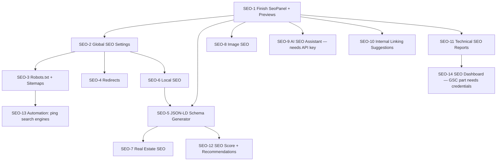

# Truzon CMS — SEO Management Module Roadmap

Companion to `ROADMAP.md` (the original 9-phase CMS build, all done). This is a **new**,
**additive** module — nothing here touches or rebuilds existing CMS functionality. Same rules as
`ROADMAP.md`: phases are dependency-ordered and relatively sized (S/M/L/XL), built one at a time,
only when explicitly asked for by name (e.g. "start SEO Phase 1").

## What already exists — don't rebuild this

The original build already covers a real slice of "SEO Management" without calling it that:

- **`SeoMeta` model + `SeoPanel` UI** (Phase 2): `seo_title`, `meta_description`, `keywords`,
  `canonical_url`, `og_title`, `og_description`, `og_image_media_id`, `twitter_card_type`,
  `robots` (default `"index,follow"`), `schema_jsonld` — attached to Pages, Blog posts, and
  Properties already. The admin UI (`seo-panel.tsx`) currently only exposes 4 of these 10 fields
  though (title/description/keywords/canonical) — OG/Twitter/robots/schema are real columns with
  no UI yet. That gap is Phase 1 below, not new schema work.
- **Site Settings** (Phase 5): `site_name`, `logo_media_id`, `favicon_media_id`,
  `analytics_ga_measurement_id`, `contact_*`, `social_*_url` already exist and are already
  public-safe-filtered via `/public/settings`.
- **Media alt text + dimensions** (Phase 3): `Media.alt_text`, `width`, `height` already exist.
  MIME-sniffing, size limits, SVG sanitization already real (`SECURITY_CHECKLIST.md` §6).
- **Blog reading time** (Phase 4): auto-computed from body word count already.
- **Audit log, RBAC, rate limiting** (Phase 6/8): any new SEO endpoints slot into the same
  `require_permission()` / `AuditService` / rate-limit patterns already wired everywhere else —
  no new cross-cutting infra needed, just a new `seo.manage` permission key.

## Decisions only you can make (these block specific phases below)

1. **AI SEO Assistant (§3 of your spec, Phase 9/14 below)** needs a real LLM API — which
   provider (Claude, OpenAI, etc.) and an API key. I won't guess; nothing in this phase can start
   without picking one.
2. **Keyword Rankings / Organic Traffic / CTR / Average Position / Impressions (§12 dashboard)**
   are not something any code can generate — that data only exists inside **Google Search
   Console**, and only if the site is already verified there and has been accumulating real
   search data. This needs GSC API credentials (OAuth/service account) from you. Without it, this
   part of the dashboard is un-buildable as real data — I will not fabricate placeholder numbers
   and present them as if real.
3. **Page Speed Score / Core Web Vitals** needs either Google's PageSpeed Insights API (a key) or
   real-user-monitoring (a much bigger lift). Same story — a real decision, not a build task.
4. **Real-estate SEO-friendly URLs** (`/hyderabad/kukatpally/3-bhk-villa-for-sale`) is a **routing
   scheme change**, not just a data change — my-app currently serves `/property/{slug}`. Changing
   this affects anything already indexed/bookmarked. Flagged for explicit sign-off before Phase 6
   touches routing, not assumed.

Everything else below needs no external service and no decision — it's pure CMS extension.

## Phase dependency graph

## Phase 1 — Finish the SEO Panel + live previews (size: M)

The data model already supports this; the UI doesn't yet.

- **Backend**: extend `SeoMeta` with `focus_keyword`, `twitter_title`, `twitter_description`,
  `twitter_image_media_id` (currently Twitter only has a `card_type`); split the single `robots`
  string into two UI toggles (Index/NoIndex, Follow/NoFollow) that compose it, so admins don't
  type raw robots directives by hand.
- **Frontend**: wire the OG/Twitter image fields to the existing `ImagePickerField` (Media
  Library, Phase 3 — the `SeoPanel` comment literally says this was deferred until Media existed,
  and it now does); add the missing fields; add three live preview components — Google SERP,
  Facebook share card, Twitter/X card — reusable across Pages/Blog/Properties.
- **Exit criteria**: editing any entity's SEO panel shows an accurate live Google/Facebook/Twitter
  preview as you type.

## Phase 2 — Global SEO Settings page (size: M)

- **Backend**: new `Setting` keys (same generic key-value table, no migration needed — same
  pattern as adding `callback_phone`/`whatsapp_number` earlier): `default_meta_title`,
  `default_meta_description`, `default_keywords`, `default_canonical_url`, `organization_name`,
  `google_verification_code`, `bing_verification_code`, `google_tag_manager_id`, `meta_pixel_id`,
  `google_search_console_verification`, `og_default_image_media_id`, `twitter_card_default_type`,
  `robots_txt_content`. (Site name/logo/favicon/GA4 ID already exist — reused, not duplicated.)
- **Frontend**: new "SEO" tab on the existing tabbed Settings page.
- **Exit criteria**: every global default is set from one screen; verification codes/pixel IDs
  are exposed via `/public/settings` for my-app to embed (these are meant to be public, unlike
  SMTP credentials — same allow-list principle already governs this).

## Phase 3 — Robots.txt + XML/HTML Sitemaps (size: M)

- **Backend**: `/public/robots.txt` (serves the admin-edited content from Phase 2, with a sane
  generated default), `/public/sitemap.xml` (auto-built from published Pages/Blog/Properties +
  `updated_at`), a sitemap data endpoint for the HTML version.
- **my-app**: `app/robots.ts` / `app/sitemap.ts` (Next.js's metadata-file convention — must
  confirm the exact current API against `node_modules/next/dist/docs` per this project's own
  "not the Next.js you know" rule before writing it) fetching from the new endpoints. The
  Footer's existing `/sitemap` link (currently a dead static route) becomes real here.
- **Exit criteria**: `my-app/robots.txt` and `/sitemap.xml` are live and reflect published content;
  editing robots.txt in the CMS changes the served file immediately.

## Phase 4 — Redirects (size: M)

- **Backend**: new `Redirect` model (`from_path`, `to_path`, `status_code` 301/302, `hit_count`)
  + CRUD endpoints, permission-gated, audit-logged like everything else.
- **Frontend**: a Redirects list page (same `DataTable` + `ConfirmDialog` pattern as
  Categories/Tags/Roles).
- **my-app**: middleware consulting the CMS's redirect list before rendering 404s.
- **Exit criteria**: creating a redirect rule in the CMS makes my-app actually 301/302 that path.

## Phase 5 — Local SEO (size: M)

- **Backend**: new Setting keys for `working_hours`, `latitude`, `longitude`, `service_areas`
  (business name/address/phone/email already exist — reused).
- **Exit criteria**: a `LocalBusiness`/`RealEstateAgent` JSON-LD block (feeds Phase 6) with real
  geo-coordinates validates in Google's Rich Results Test.

## Phase 6 — JSON-LD Schema Generator (size: L)

- **Backend**: a schema-builder service producing valid JSON-LD for Organization, WebSite +
  SearchAction, LocalBusiness/RealEstateAgent (Phase 5's data), Product (Property),
  Article/BlogPosting, FAQPage (reusing the **existing** `faq` block's items — no new content
  model needed), BreadcrumbList, ImageObject/VideoObject (Media already has the fields).
  `SeoMeta.schema_jsonld` already exists as a manual-override column — wire a raw JSON editor for
  it, defaulting to the auto-generated schema.
- **my-app**: inject the `<script type="application/ld+json">` tag per page.
- **Exit criteria**: Home, a property, and a blog post all pass Google's Rich Results Test.

## Phase 7 — Real Estate SEO (size: L — routing decision required first)

- **Backend**: extend `Property` with `locality`, `builder_name`, `amenities` (JSON list) —
  `bhk`≈`beds_options`, `price_range`≈`budget_bracket`, `project_name`≈`name` already exist. A
  title-generation helper composing "3 BHK Villa for Sale in Kukatpally, Hyderabad" style titles.
- **URL restructuring is a separate, explicit decision** (see above) — title/keyword generation
  can ship without it.
- **Exit criteria**: property SEO titles auto-generate from structured fields, editable after.

## Phase 8 — Image SEO (size: M)

- **Backend**: add `title`/`caption` fields to `Media` (alt text/dimensions already exist);
  extend `MediaService.upload()` (already using Pillow for dimensions) to also re-encode to
  compressed WebP. Lazy-loading is already free via `next/image`'s default behavior — nothing to
  build there, just worth confirming/documenting rather than re-implementing.
- **Exit criteria**: new uploads are automatically compressed WebP; Title/Caption editable and
  exposed through `/public/*` media URLs.

## Phase 9 — AI SEO Assistant (size: XL — needs an LLM API key)

- **Backend**: `AiSeoService` wrapping the chosen LLM API with prompt templates for SEO
  title/description/keywords, alt text, FAQ generation, schema suggestions, blog outlines,
  property descriptions. Rate-limited per-call (these cost real money), same pattern as the
  existing `rate_limit()` helper.
- **Frontend**: "Generate with AI" buttons beside the relevant fields, editable before accepting
  — never auto-saved without a human looking at it.
- **Exit criteria**: clicking "Generate SEO Title" on a property produces a real, usable
  suggestion.

## Phase 10 — Internal Linking Suggestions (size: L)

- **Backend**: a suggestion engine using data that already exists — shared categories, city/
  locality proximity for properties, tag overlap for blog posts. No AI required for a useful
  first pass (Phase 9 could enhance it later, but doesn't gate it).
- **Exit criteria**: editing a blog post surfaces related properties/articles with one-click
  link insertion.

## Phase 11 — Technical SEO Reports (size: M)

- Missing alt text / missing meta description / duplicate title reports are plain queries against
  data that already exists (`Media.alt_text IS NULL`, `SeoMeta.meta_description IS NULL`) —
  genuinely buildable now, no dependency. Broken-link detection needs a small crawler job over
  internal links in Page/Blog/Property body content.
- **Exit criteria**: one report page lists every entity missing alt text or a meta description,
  linking straight to the fix.

## Phase 12 — SEO Score + Recommendations (size: L)

- A **rule-based** 0–100 score using only data that already exists: has meta description? title
  length in range? has focus keyword? has OG image? has schema? image alt-text coverage? internal
  link count? No AI needed for the score itself — Phase 9's assistant can optionally turn a flag
  into better-written suggestion text later, but doesn't gate this.
- **Exit criteria**: every Page/Post/Property shows a score badge + checklist of what's missing.

## Phase 13 — Automation hooks (size: S)

- "Regenerate sitemap after publishing" is already automatic by construction (Phase 3's sitemap
  is generated per-request from live data, not a cached file — nothing to regenerate). Same for
  schema (Phase 6) and image optimization (Phase 8, happens at upload time). The one real new
  piece: **ping Google/Bing's sitemap endpoints on publish** — small, concrete, buildable now.
- Cache-clearing is not-yet-applicable: my-app fetches everything with `cache: "no-store"" by
  design (Phase 7 of the original roadmap) — there is no cache to clear until that changes.

## Phase 14 — SEO Dashboard (size: XL — GSC part needs credentials)

- **Buildable now, no external service**: a first-party page-view counter (a `PageView` table +
  increment endpoint) for "Most Visited Properties/Blogs" — simple, real, no dependency.
- **Gated on your decision (see above)**: Indexed/Non-Indexed pages, Keyword Rankings, Organic
  Traffic, CTR, Average Position, Impressions, Page Speed Score all require real external data
  (Google Search Console API + PageSpeed Insights API) — this half of the dashboard stays
  unbuilt until those credentials exist, rather than shipping with fabricated numbers.

## Ongoing — Future-proofing (not a discrete phase, like the original Phase 8 Hardening)

Rich-results eligibility is already covered by Phase 6's schema work. Voice search / featured
snippets are mostly an editorial concern (the existing FAQ block's Q&A structure already suits
this) rather than a code task. Worth a periodic look, not a one-time build.

---

**Next**: say which phase to start (e.g. "start SEO Phase 1") — same one-at-a-time cadence as the
original roadmap. Phases 1–3 have no external dependency and no open decision, so they're the
natural place to begin if you want to keep moving without waiting on any of the four decisions
above.
